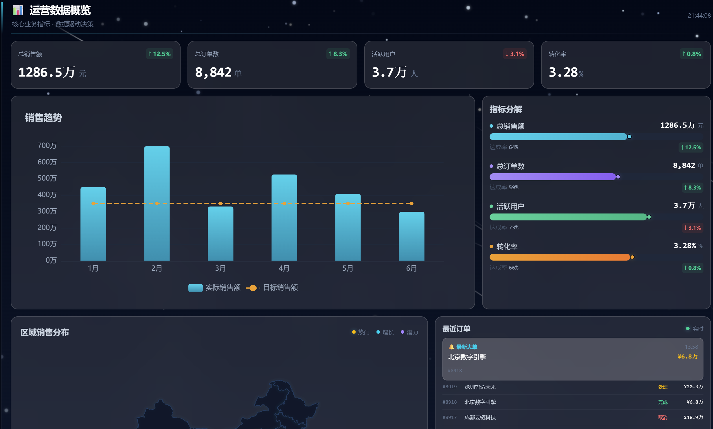
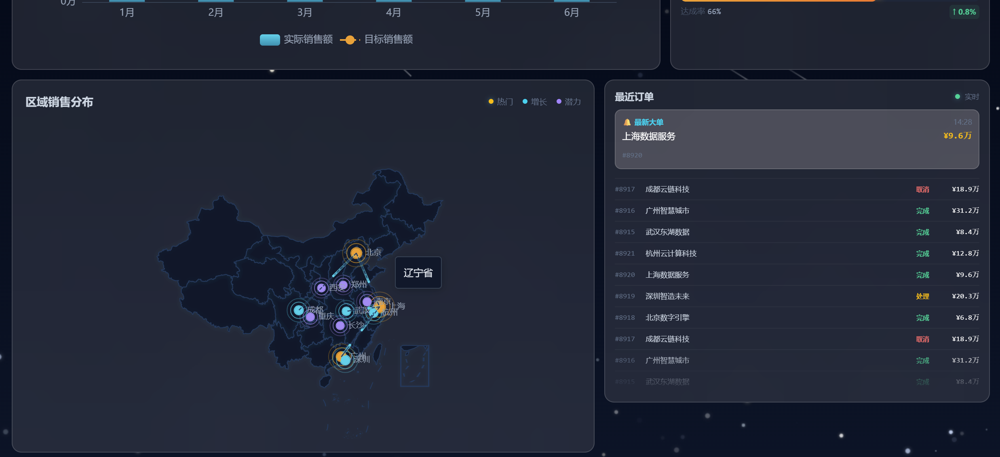
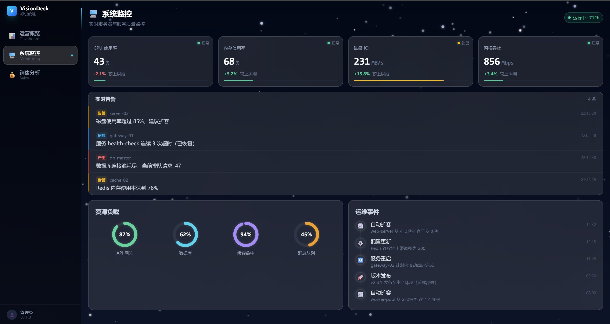
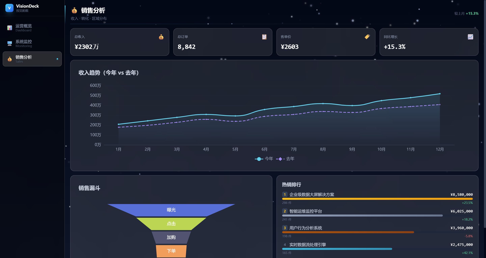

# VisionDeck · 视觉舱舰

<p align="center">
  
  
  
  
  
</p>

<p align="center">
  <b>开箱即用的数据大屏解决方案</b><br/>
  星空背景 · 毛玻璃质感 · 实时数据可视化
</p>

---

## 📸 预览

<p align="center">
  <em>星空背景 · 毛玻璃质感 · 实时数据可视化</em>
</p>

### 运营概览 Dashboard
> KPI 数字滚动卡片 + ECharts 销售趋势 + 指标分解动画 + 中国地图 + 实时订单流

<p align="center">
  
  
</p>

### 系统监控 Monitoring
> 实时指标脉冲灯 + 分级告警列表 + SVG 环形仪表 + 运维事件时间线

<p align="center">
  
</p>

### 销售分析 Sales
> 全年收入趋势对比 + ECharts 漏斗转化 + 热销 TOP5 排行榜 + 区域分布

<p align="center">
  
</p>

---

## ✨ 特性

| 类别 | 功能 |
|------|------|
| 🎨 **视觉** | Canvas 星空背景（350 星 + 流星）、毛玻璃卡片、数字滚动动画、卡片交错入场 |
| 📊 **图表** | ECharts 柱状图/漏斗图/面积图/中国地图、SVG 环形仪表、自定义条形图 |
| 🔄 **数据** | MSW 网络层 Mock，删除一行代码即可切换真实 API；数据适配器层解耦 |
| 🧱 **架构** | 四层模块化：`app/` → `modules/` → `shared/` → `infrastructure/` |
| 🛡️ **质量** | TypeScript strict、Vitest 单元测试、Playwright E2E、Husky + commitlint |
| 🎭 **动效** | CountUp 数字滚动、AnimatedCard 入场、订单自动翻滚、地图光点脉冲、骨架屏 |

---

## 🚀 快速开始

```bash
# 克隆
git clone https://github.com/xlaoshu411-maker/VisionDeck.git
cd VisionDeck

# 安装依赖
npm install

# 启动开发服务器
npm run dev
# → http://localhost:3000

# 运行测试
npm test

# 生产构建
npm run build
```

---

## 📁 项目结构

```
VisionDeck/
├── src/
│   ├── app/                         # 应用壳
│   │   ├── layout/AppLayout.tsx     #   侧边栏 + 全局布局
│   │   ├── providers/               #   Provider 组合
│   │   └── router.tsx               #   React Router v7
│   ├── modules/
│   │   ├── dashboard/               # 运营概览
│   │   │   ├── api.ts               #   接口定义
│   │   │   ├── store.ts             #   Zustand 状态
│   │   │   ├── hooks/               #   数据 hooks
│   │   │   ├── components/          #   StatCard / SalesChart / StatBreakdown / TrafficSource / RecentOrders
│   │   │   └── pages/               #   路由入口
│   │   ├── monitoring/              # 系统监控
│   │   │   └── components/          #   RealtimeCard / AlertList / ResourceGauge / EventTimeline
│   │   └── sales/                   # 销售分析
│   │       └── components/          #   SalesFunnel / TopProducts / RevenueTrend
│   ├── shared/                      # 跨模块共享
│   │   ├── components/              #   AnimatedCard / CountUp / Skeleton / ChinaMap / ...
│   │   ├── animation/               #   动画变体定义
│   │   ├── hooks/                   #   通用 hooks
│   │   └── utils/                   #   格式化工具
│   ├── infrastructure/              # 基础设施
│   │   ├── logger/                  #   分级日志系统
│   │   ├── http/                    #   axios 封装 + 拦截器
│   │   ├── mock/                    #   MSW handlers（按模块）
│   │   └── adapters/               #   数据适配器
│   └── config/                      # 环境变量
├── tests/
│   ├── unit/                        # Vitest 单元测试
│   ├── integration/                 # MSW 集成测试
│   └── e2e/                         # Playwright E2E
├── public/
│   └── china.json                   # 中国地图 GeoJSON
├── scripts/
│   └── screenshots.mjs              # 自动截图脚本
└── ...配置文件
```

---

## 🔧 技术栈

| 层 | 选型 | 说明 |
|----|------|------|
| 框架 | React 19 + TypeScript 6 | 类型安全，生态丰富 |
| 构建 | Vite 8 | 秒级 HMR |
| 状态 | Zustand 5 | 轻量，模块级 store |
| 图表 | ECharts 6 | 数据大屏首选 |
| Mock | MSW 2 | Service Worker 拦截，零侵入 |
| HTTP | axios | 拦截器链 |
| 样式 | TailwindCSS 4 | 原子化 + 毛玻璃 |
| 测试 | Vitest + Playwright | 单元 + E2E |
| 质量 | Husky + commitlint + oxlint | 提交门禁 |

---

## 🎮 开发指南

### 新增模块

在 `src/modules/` 下复制 dashboard 模板结构：

```
modules/your-module/
├── types.ts          # 类型定义
├── api.ts            # 接口调用
├── store.ts          # Zustand store
├── hooks/            # 数据 hooks
├── components/       # 模块组件
├── pages/            # 路由页面
└── index.ts          # 公共出口
```

然后在 `src/infrastructure/mock/handlers/` 添加 MSW handler，在 `src/app/router.tsx` 注册路由。

### Mock ↔ API 切换

```ts
// src/main.tsx
if (import.meta.env.DEV) {
  await startMockWorker() // 删除此行即走真实 API
}
```

### 截图

```bash
npm run dev          # 先启动服务
node scripts/screenshots.mjs  # 自动截取三页截图到 screenshots/
```

---

## 📄 License

MIT © 2026 VisionDeck Team
